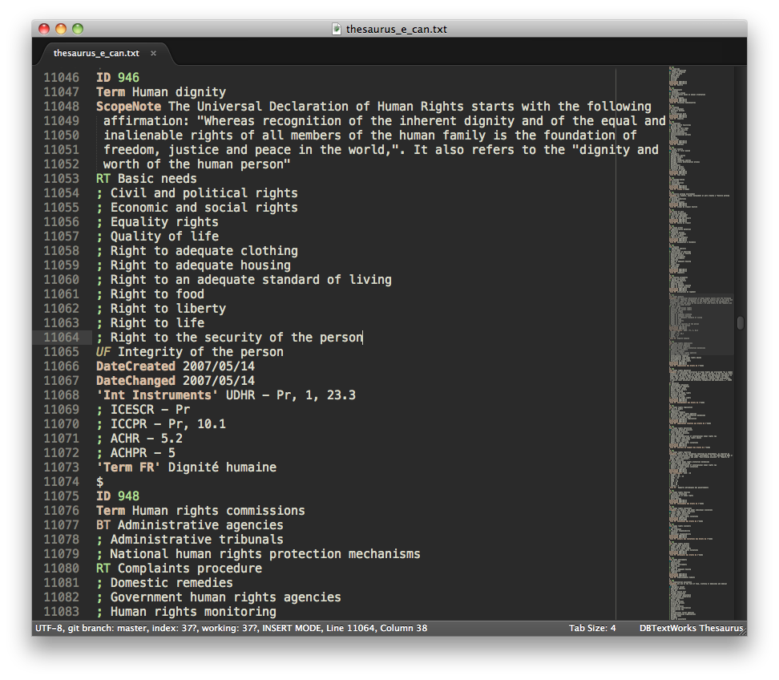

DB/TextWorks Syntax Highlighting for Sublime Text and TextMate
==============================================================

This simple syntax highlighting makes working with text file dumps from DB/TextWorks thesauri much easier.

Note that the syntax regions are assigned arbitrarily to get attractive colours. "UF" isn't actually a comment, etc.

(It's questionable whether this is really the DB/TextWorks syntax at all, since I don't have the software. This was written for a set of .txt files from DB/TextWorks users I've had to work with, and based on the syntax of those. I'm assuming that's actually DB/TextWorks format.)
